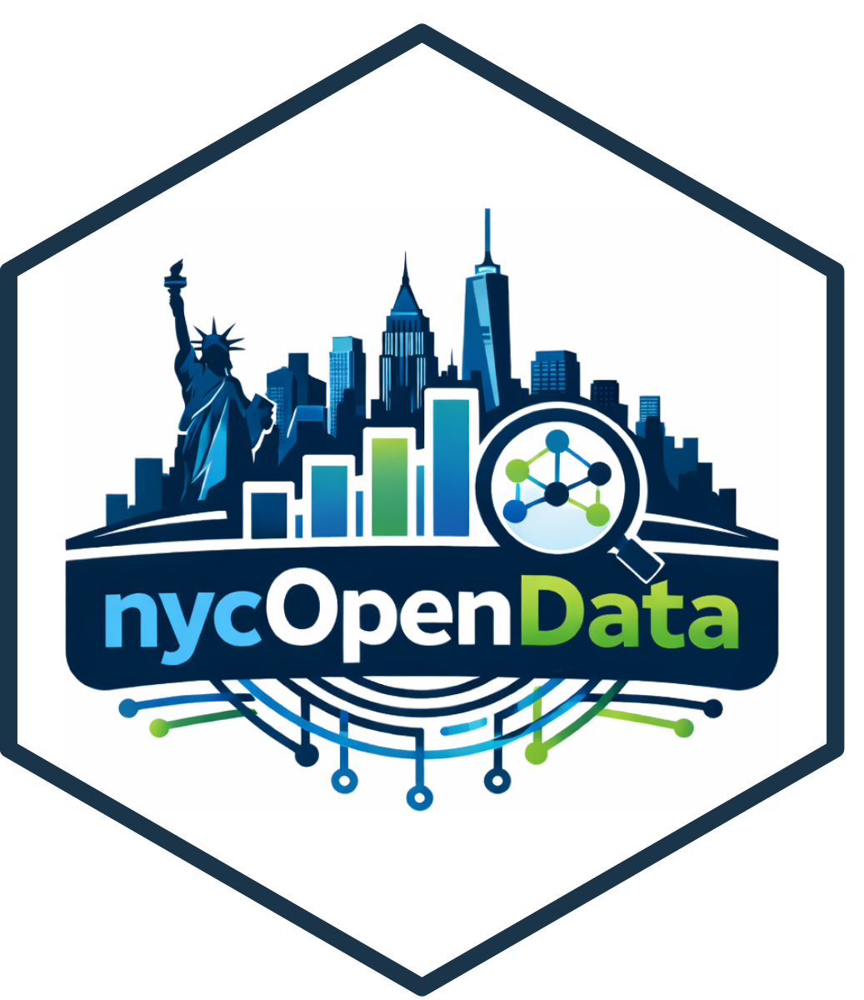

# nycOpenData 

[](https://CRAN.R-project.org/package=nycOpenData)
[](https://r-pkg.org/pkg/nycOpenData)
[](https://lifecycle.r-lib.org/articles/stages.html)
[](https://www.repostatus.org/#active)
[](https://app.codecov.io/gh/martinezc1/nycOpenData)
[](https://www.r-bloggers.com/2026/01/nycopendata-a-unified-r-interface-to-nyc-open-data-apis/)
[](https://rweekly.org/#RintheRealWorld)
[](https://github.com/martinezc1/nycOpenData/actions/workflows/R-CMD-check.yaml)

`nycOpenData` provides a lightweight R interface to the [NYC Open
Data](https://opendata.cityofnewyork.us/) Socrata API.

The package allows users to search, filter, and download datasets from
the NYC Open Data Portal directly into R without manually constructing
API queries, handling JSON responses, or performing type conversion.

Designed primarily for students, educators, and researchers,
`nycOpenData` reduces the technical overhead required to begin working
with civic datasets while still exposing the underlying structure of the
NYC Open Data ecosystem.

Version **0.2.2** introduces a streamlined, catalog-driven interface for
NYC Open Data.

While users may still explore datasets through the NYC Open Data Portal
itself, `nycOpenData` streamlines the transition from discovery to
reproducible analysis within R workflows.

------------------------------------------------------------------------

## How nycOpenData Works

The package wraps the NYC Open Data Portal’s Socrata API.

Internally, `nycOpenData`:

- retrieves metadata from live NYC Open Data catalog tables
- constructs parameterized HTTP GET requests
- downloads JSON responses from Socrata endpoints
- converts results into tidy tibble outputs
- optionally performs automatic column type coercion

Automatic type coercion uses heuristic-based parsing to infer common
column types from Socrata API responses.

Most workflows begin with `nyc_list_datasets()`, which retrieves a live
catalog of available datasets from NYC Open Data (`5tqd-u88y`).

Datasets can then be downloaded using either:

- a human-readable catalog `key` (recommended)
- the raw Socrata dataset UID (e.g. `"erm2-nwe9"`)

The catalog `key` is designed to be easier to remember and use in
classroom settings, while the Socrata UID is the stable identifier used
internally by the NYC Open Data Portal.

The package provides three core functions:

- `nyc_list_datasets()` — Retrieve a live catalog of available NYC Open
  Data datasets, including dataset titles, human-readable keys, Socrata
  UIDs, endpoint URLs, and metadata used throughout the package.
- `nyc_pull_dataset()` — Download cataloged NYC Open Data datasets using
  either a human-readable key or dataset UID, with support for
  filtering, ordering, date ranges, automatic type coercion, and
  optional column name cleaning.
- `nyc_any_dataset()` — Pull data directly from arbitrary NYC Open Data
  Socrata JSON endpoints without requiring inclusion in the internal
  package catalog.

Datasets pulled via `nyc_pull_dataset()` automatically apply sensible
defaults from the catalog (such as default ordering and date fields),
while still allowing user control over:

- `limit`
- `filters`
- `date` / `from` / `to`
- `where`
- `order`
- `clean_names`
- `coerce_types`

Datasets can be referenced using either:

- a human-readable catalog `key` (recommended), or
- the underlying Socrata dataset UID (e.g. `"erm2-nwe9"`)

The catalog `key` system was designed to improve readability and
usability in classroom and reproducible research settings, where
memorizing opaque Socrata UIDs can create unnecessary friction for new
users.

All functions return clean **tibble** outputs and support filtering
via  
`filters = list(field = "value")`.

Advanced users may optionally provide raw SoQL queries through the
`where` argument.

SoQL (Socrata Query Language) is the filtering and query syntax used by
Socrata-powered open data portals:
<https://dev.socrata.com/docs/queries/>

------------------------------------------------------------------------

## Installation

### From **CRAN**

``` r
install.packages("nycOpenData")
```

### Development version (GitHub)

``` r
devtools::install_github("martinezc1/nycOpenData")
```

------------------------------------------------------------------------

## Example

``` r
library(nycOpenData)
library(dplyr)
```

    ## Warning: package 'dplyr' was built under R version 4.5.2

    ## 
    ## Attaching package: 'dplyr'

    ## The following objects are masked from 'package:stats':
    ## 
    ##     filter, lag

    ## The following objects are masked from 'package:base':
    ## 
    ##     intersect, setdiff, setequal, union

``` r
# Browse available datasets
catalog <- nyc_list_datasets()

# Search for 311-related datasets
catalog %>%
  filter(grepl("311", name, ignore.case = TRUE)) %>%
  select(key, name)
```

    ## # A tibble: 15 × 2
    ##    key                                            name                          
    ##    <chr>                                          <chr>                         
    ##  1 x311_service_requests_for_2004                 311 Service Requests for 2004 
    ##  2 x311_call_center_inquiry                       311 Call Center Inquiry       
    ##  3 x311_service_level_agreements                  311 Service Level Agreements  
    ##  4 x311_service_requests_for_2008                 311 Service Requests for 2008 
    ##  5 x311_interpreter_wait_time                     311 Interpreter Wait Time     
    ##  6 x311_service_requests_for_2009                 311 Service Requests for 2009 
    ##  7 x311_service_requests_from_2010_to_2019        311 Service Requests from 201…
    ##  8 x311_service_requests_for_2007                 311 Service Requests for 2007 
    ##  9 x311_service_requests_for_2005                 311 Service Requests for 2005 
    ## 10 x311_service_requests_from_2020_to_present     311 Service Requests from 202…
    ## 11 x311_service_requests_for_2006                 311 Service Requests for 2006 
    ## 12 public_feedback_on_311_request_complaint_types Public feedback on 311 reques…
    ## 13 x311_resolution_satisfaction_survey            311 Resolution Satisfaction S…
    ## 14 x311_web_content_services                      311 Web Content - Services    
    ## 15 x311_customer_satisfaction_survey              311 Customer Satisfaction Sur…

``` r
# Pull recent 311 requests
requests <- nyc_pull_dataset(
  dataset = "x311_service_requests_from_2020_to_present",
  limit = 100
)

# Pull filtered data
brooklyn_nypd <- nyc_pull_dataset(
  dataset = "x311_service_requests_from_2020_to_present",
  limit = 100,
  filters = list(
    agency = "NYPD",
    city = "BROOKLYN"
  )
)
```

The `filters` argument accepts named lists and automatically generates
appropriate SoQL filtering statements.

For example:

``` r
filters = list(
  borough = c("BROOKLYN", "QUEENS")
)
```

## This internally generates a SQL-style `IN` clause within the resulting SoQL query.

## Learn by example

- `vignette("nyc-311", package = "nycOpenData")` – Working with NYC 311
  data end-to-end

## About

`nycOpenData` makes New York City’s civic datasets accessible to
students,  
educators, analysts, and researchers through a unified and user-friendly
R interface.  
Developed to support reproducible research, open-data literacy, and
real-world analysis.

------------------------------------------------------------------------

## Development

`nycOpenData` uses cassette-based testing through the `vcr` and
`webmockr` packages to mock API responses during testing.

To run tests locally:

``` r
devtools::test()
```

Recorded fixtures are stored in:

``` r
tests/testthat/fixtures/
```

------------------------------------------------------------------------

## Comparison to Other Software

While the [`RSocrata`](https://CRAN.R-project.org/package=RSocrata)
package provides a general interface for any Socrata-backed portal,
`nycOpenData` is specifically tailored for the New York City ecosystem.

- **Low-friction onboarding**: Designed so students can begin working
  with NYC civic datasets in minutes without needing to manually
  construct API requests.
- **Readable dataset identifiers**: Uses stable catalog-driven keys
  instead of requiring users to memorize Socrata dataset UIDs.
- **Pedagogical design**: Emphasizes transparency, reproducibility, and
  classroom-friendly workflows for teaching open data literacy.
- **Lightweight workflow**: Returns clean tibble outputs with minimal
  configuration and dependencies.

------------------------------------------------------------------------

## Contributing

We welcome contributions! If you find a bug or would like to request a
wrapper for a specific NYC dataset, please open an issue or submit a
pull request on [GitHub](https://github.com/martinezc1/nycOpenData).

------------------------------------------------------------------------

## Authors & Contributors

### Maintainer

**Christian A. Martinez** 📧 <c.martinez0@outlook.com>  
GitHub: [@martinezc1](https://github.com/martinezc1)

### ✨ Contributors

Special thanks to the students of **PSYC 7750G – Reproducible
Psychological Research** at Brooklyn College (CUNY) who have contributed
functions and documentation:

- **Crystal Adote** ([@crystalna20](https://github.com/crystalna20))
- **Jonah Dratfield** ([@jdratfield38](https://github.com/jdratfield38))
- **Joyce Escatel-Flores**
  ([@JoyceEscatel](https://github.com/JoyceEscatel))
- **Rob Hutto** ([@robhutto](https://github.com/robhutto))
- **Isley Jean-Pierre** ([@ijpier](https://github.com/ijpier))
- **Shannon Joyce** ([@shannonjoyce](https://github.com/shannonjoyce))
- **Laura Rose-Werner**
  ([@laurarosewerner](https://github.com/laurarosewerner))
- **Emma Tupone** ([@emmatup0205](https://github.com/emmatup0205))
- **Xinru Wang** ([@xrwangxr](https://github.com/xrwangxr))

------------------------------------------------------------------------

## Academic Context

This package is developed as a primary pedagogical tool for teaching
data acquisition and open science practices at **Brooklyn College, City
University of New York (CUNY)**.

------------------------------------------------------------------------

## Maintenance

Because the package retrieves metadata dynamically from the live NYC
Open Data catalog, many newly published datasets can be accessed without
requiring package updates.

------------------------------------------------------------------------

## Disclaimer

`nycOpenData` is an independent project and is not affiliated with,
endorsed by, or maintained by the City of New York.
