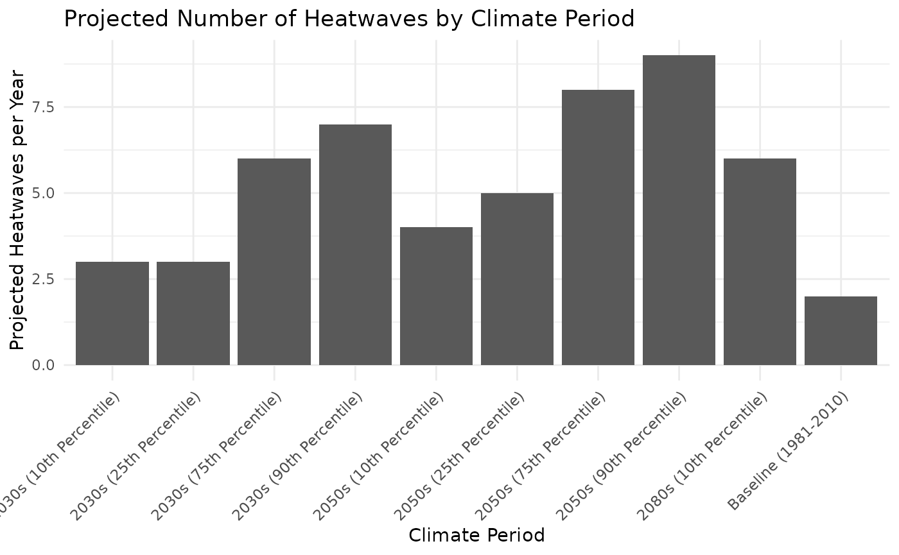

# Analyzing NYC Climate Projections: Extreme Events and Sea Level Rise

## Introduction

This vignette demonstrates how to use the nyc_events_sealevel() function
to explore projected extreme climate events and sea level rise for New
York City using the [New York City Climate Projections: Extreme Events
and Sea Level
Rise](https://data.cityofnewyork.us/Environment/New-York-City-Climate-Projections-Extreme-Events-a/38ps-fnsg/about_data)
dataset on the NYC Open Data portal.

The dataset provides projections under different climate scenarios,
including:

- Number of heatwaves per year
- Cooling and heating degree days
- Projected sea level rise

Researchers, city planners, and policymakers can use this information to
understand future climate risks, prepare for extreme weather events, and
plan adaptation strategies.

## Retrieve a Sample of Data

``` r
sample_data <- nyc_events_sealevel(limit = 10)

sample_data
#> # A tibble: 10 × 16
#>    period           sea_lelel_rise number_of_days_year_…¹ number_of_days_year_…²
#>    <chr>            <chr>                           <dbl>                  <dbl>
#>  1 Baseline (1981-… n/a                                69                     17
#>  2 2030s (10th Per… 6 in                               85                     27
#>  3 2030s (25th Per… 7 in                               85                     27
#>  4 2030s (75th Per… 11 in                              99                     46
#>  5 2030s (90th Per… 13 in                             104                     54
#>  6 2050s (10th Per… 12 in                              91                     32
#>  7 2050s (25th Per… 14 in                              99                     38
#>  8 2050s (75th Per… 19 in                             100                     62
#>  9 2050s (90th Per… 23 in                             121                     69
#> 10 2080s (10th Per… 21 in                             104                     46
#> # ℹ abbreviated names: ¹​number_of_days_year_with, ²​number_of_days_year_with_1
#> # ℹ 12 more variables: number_of_days_year_with_2 <dbl>,
#> #   number_of_days_year_with_3 <dbl>, number_of_heatwaves_year <dbl>,
#> #   average_lenth_of_heat_waves <dbl>, number_of_days_year_with_4 <dbl>,
#> #   number_of_days_year_with_5 <dbl>, cooling_degree_days <dbl>,
#> #   number_of_days_year_with_6 <dbl>, heating_degree_days <dbl>,
#> #   number_of_days_year_with_7 <dbl>, number_of_days_year_with_8 <dbl>, …
```

This code retrieves 10 rows of data from the NYC Open Data endpoint for
extreme events and sea level rise projections.

## Summarize Key Metrics

``` r
summary_table <- sample_data |>
  select(period, number_of_heatwaves_year, cooling_degree_days, heating_degree_days) |> dplyr::slice_head(n = 10)

summary_table
#> # A tibble: 10 × 4
#>    period         number_of_heatwaves_…¹ cooling_degree_days heating_degree_days
#>    <chr>                           <dbl>               <dbl>               <dbl>
#>  1 Baseline (198…                      2                1156                4659
#>  2 2030s (10th P…                      3                1397                3589
#>  3 2030s (25th P…                      3                1471                3766
#>  4 2030s (75th P…                      6                1757                4049
#>  5 2030s (90th P…                      7                1903                4240
#>  6 2050s (10th P…                      4                1568                3102
#>  7 2050s (25th P…                      5                1713                3384
#>  8 2050s (75th P…                      8                2124                3754
#>  9 2050s (90th P…                      9                2335                3996
#> 10 2080s (10th P…                      6                1817                2298
#> # ℹ abbreviated name: ¹​number_of_heatwaves_year
```

- Period=climate period (e.g., “Baseline”, “2030s”)
- number_of_heatwaves_year=projected heatwaves per year
- cooling_degree_days/heating_degree_days=metrics of temperature
  extremes

This table gives a quick overview of projected extreme events for
different scenarios.

## Visualization

``` r
plot_data <- sample_data |>
  mutate(number_of_heatwaves_year = as.numeric(number_of_heatwaves_year))

ggplot(plot_data, aes(x = period, y = number_of_heatwaves_year)) +
  geom_col() +
  labs(
    title = "Projected Number of Heatwaves by Climate Period",
    x = "Climate Period",
    y = "Projected Heatwaves per Year"
  ) +
  theme_minimal() +
  theme(axis.text.x = element_text(angle = 45, hjust = 1))
```



This plot shows how the number of heatwaves is projected to change
across scenarios. It helps visualize future climate risks at a glance.
