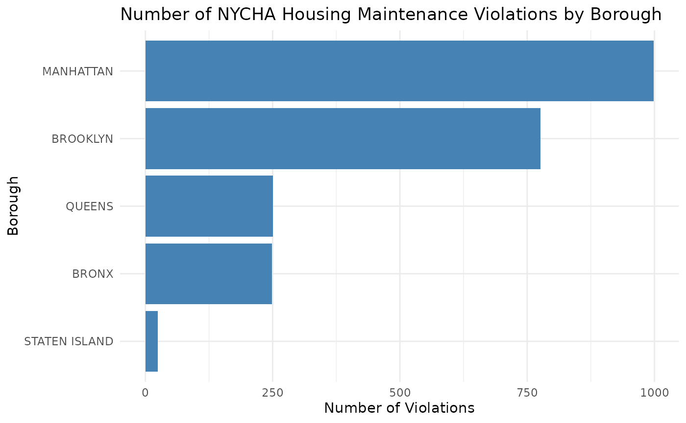

# Analyzing NYCHA Housing Maintenance Code Violations

## Introduction

The [NYCHA Housing Maintenance Code Violations
dataset](https://data.cityofnewyork.us/Housing-Development/Housing-Maintenance-Code-Violations/wvxf-dwi5/about_data),
available through NYC Open Data, provides detailed information about
maintenance violations in public housing developments across New York
City.

This dataset includes information such as the borough, development name,
violation type, inspection dates, and status. Researchers, policymakers,
and residents can use this data to better understand housing conditions,
identify recurring maintenance issues, and explore patterns across
boroughs.

## Data

We begin by retrieving the dataset using the nycOpenData package:

``` r
violations <- nyc_ha_violations()

violations |>
  dplyr::slice_head(n = 6)
#> # A tibble: 6 × 35
#>   viol_seq_no bldg_id  boro boro_nm  phn   low_hus_no high_hus_no str_nm     zip
#>         <dbl>   <dbl> <dbl> <chr>    <chr> <chr>      <chr>       <chr>    <dbl>
#> 1    18649779  807044     2 BRONX    1350  1350       1350        WASHING… 10456
#> 2    18641288  807996     3 BROOKLYN 35    35         53          DWIGHT … 11231
#> 3    18641287  807996     3 BROOKLYN 35    35         53          DWIGHT … 11231
#> 4    18641286  807996     3 BROOKLYN 35    35         53          DWIGHT … 11231
#> 5    18641048  671394     4 QUEENS   69-01 69-01      69-15       KISSENA… 11367
#> 6    18641047  671394     4 QUEENS   69-01 69-01      69-15       KISSENA… 11367
#> # ℹ 26 more variables: development_name <chr>, tds_no <dbl>,
#> #   stairhall_no <dbl>, sctn_boro <dbl>, sctn_boro_nm <chr>, sctn_hus_no <chr>,
#> #   sctn_str_nm <chr>, sctn_zip <dbl>, actl_unit_insp <chr>, actl_stry <dbl>,
#> #   blk <dbl>, lot <dbl>, viol_desc <chr>, hzrd_clas <chr>, insp_dt <dttm>,
#> #   viol_appr_dt <dttm>, viol_typ_ordr_no <dbl>, issued_in_err <chr>,
#> #   latitude <dbl>, longitude <dbl>, community_board <dbl>,
#> #   council_district <dbl>, bin <dbl>, bbl <dbl>, census_tract <dbl>, …
```

The [`glimpse()`](https://pillar.r-lib.org/reference/glimpse.html)
function allows us to quickly inspect the structure of the dataset,
including available variables and their data types.

## Count violations by borough

Next, we summarize the number of violations recorded in each borough:

``` r
borough_counts <- violations |>
  count(boro_nm, sort = TRUE)

borough_counts
#> # A tibble: 5 × 2
#>   boro_nm           n
#>   <chr>         <int>
#> 1 MANHATTAN       941
#> 2 BROOKLYN        728
#> 3 BRONX           245
#> 4 QUEENS          225
#> 5 STATEN ISLAND    24
```

## Visual

To better understand the distribution, we create a bar chart:

``` r
borough_counts |>
  ggplot(aes(x = reorder(boro_nm, n), y = n)) +
  geom_col(fill = "steelblue") +
  coord_flip() +
  labs(
    title = "Number of NYCHA Housing Maintenance Violations by Borough",
    x = "Borough",
    y = "Number of Violations"
  ) +
  theme_minimal()
```



This visualization highlights which boroughs have the highest number of
recorded maintenance violations. Differences across boroughs may reflect
variation in the number of developments, building age, reporting
practices, or underlying housing conditions. Further analysis could
investigate violation types, severity levels, or trends over time.
