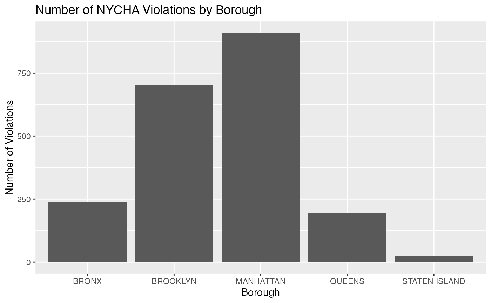

# Analyzing NYCHA Housing Maintenance Code Violations

## Introduction

The NYCHA Housing Maintenance Code Violations dataset provides
information about maintenance violations in public housing developments
across New York City.

This dataset is important because it helps researchers, policymakers,
and residents understand housing conditions and identify patterns in
maintenance issues.

## data

``` r
data <- nyc_ha_violations()

head(data)
```

    ## # A tibble: 6 × 35
    ##   viol_seq_no bldg_id boro  boro_nm   phn   low_hus_no high_hus_no str_nm  zip  
    ##   <chr>       <chr>   <chr> <chr>     <chr> <chr>      <chr>       <chr>   <chr>
    ## 1 18629669    805002  1     MANHATTAN 1829  1829       1839        LEXING… 10029
    ## 2 18629670    805002  1     MANHATTAN 1829  1829       1839        LEXING… 10029
    ## 3 18629671    805002  1     MANHATTAN 1829  1829       1839        LEXING… 10029
    ## 4 18629672    805002  1     MANHATTAN 1829  1829       1839        LEXING… 10029
    ## 5 18629673    805002  1     MANHATTAN 1829  1829       1839        LEXING… 10029
    ## 6 18629674    805002  1     MANHATTAN 1829  1829       1839        LEXING… 10029
    ## # ℹ 26 more variables: development_name <chr>, tds_no <chr>,
    ## #   stairhall_no <chr>, sctn_boro <chr>, sctn_boro_nm <chr>, sctn_hus_no <chr>,
    ## #   sctn_str_nm <chr>, sctn_zip <chr>, actl_unit_insp <chr>, actl_stry <chr>,
    ## #   blk <chr>, lot <chr>, viol_desc <chr>, hzrd_clas <chr>, insp_dt <chr>,
    ## #   viol_appr_dt <chr>, viol_typ_ordr_no <chr>, issued_in_err <chr>,
    ## #   latitude <chr>, longitude <chr>, community_board <chr>,
    ## #   council_district <chr>, bin <chr>, bbl <chr>, census_tract <chr>, …

## Count violations by borough

``` r
data %>%
  count(boro_nm)
```

    ## # A tibble: 5 × 2
    ##   boro_nm           n
    ##   <chr>         <int>
    ## 1 BRONX           237
    ## 2 BROOKLYN        701
    ## 3 MANHATTAN       909
    ## 4 QUEENS          196
    ## 5 STATEN ISLAND    24

## Visual

``` r
data %>%
  count(boro_nm) %>%
  ggplot(aes(x = boro_nm, y = n)) +
  geom_col() +
  labs(
    title = "Number of NYCHA Violations by Borough",
    x = "Borough",
    y = "Number of Violations"
  )
```


